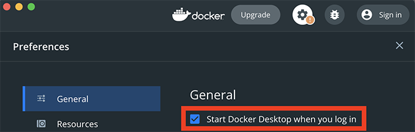

<!-- markdownlint-disable MD033 -->
<!-- markdownlint-disable MD036 -->

# vscode-dev-container

Supercharge your Visual Studio Code to code faster, easier, and more enjoyably in any language (Python, Powershell, Shell, Markdown, YAML, TOML, and more) in this fully pre-configured, customized, optimized, and isolated dev environment. Say goodbye to other IDE's like Pycharm, Windows PowerShell ISE, etc.

With the code from this repo, your Visual Studio Code will be fully configured and optimized with multi-language support and enhancements using a preconfigured dev container. No more wasting time finding and installing extensions, configuring settings, etc.

Additionally installed are a collection of custom tools designed to simplify and speed up development and administration (ex. creating projects from predefined templates).

Finally, all your project dependencies will live and run in a [dev container](https://code.visualstudio.com/docs/remote/containers), isolated from your host system (similar but more powerful than Python virtual environments); keeping your host system clean and allowing you to easily and quickly port your dev environment to another system when needed.

Installation, customization, and usage is a snap.

## Highlights

While this container is packed with ton of great features, here are just some of the highlights.

<table><tr><td>Language</td><td>Highlights</td></tr>
<tr><td>All</td><td><ul><li><a href="#configuration">Easily configure</a> container time zone, terminal themes, additional packages, etc.<li><a href="#create-a-project-from-a-template">Create projects from configurable templates</a></li><li>Standardize Run button across all executable file types</li><li>Terminal theming through <a href="https://ohmyposh.dev" target="_blank">oh-my-posh</a></li><li>Quick action helpers (ex. create project from template) available via VS Code Tasks or terminal</li><li>IDE enhancements like better fonts, icons for file/folder, task explorer, TODO tree, etc.</li><li>More...</li></ul></td></tr>
<tr><td>Markdown</td><td><ul><li>Auto-Preview</li><li>Formatting (markdownlint)</li><li>Linting (markdownlint)</li><li>More...</li></ul></td></tr>
<tr><td>Python</td><td><ul><li>Auto-REPL</li><li>Documenting (autoDocstring)</li><li>Execution (code runner)</li><li>Formatting (black, autopep8, yapf)</li><li>Intellisense (pylance, type hints)</li><li>Linting (mypy, bandit, flake8, pylint, pycodestyle)</li><li>Testing (pytest)</li><li>More...</li></ul></td></tr>
<tr><td>PowerShell</td><td><ul><li>Execution (code runner)</li><li>Formatting (powershell)</li><li>Intellisense (powershell)</li><li>Linting (psscriptanalyzer)</td></tr>
<tr><td>Shell</td><td><ul><li>Debugging (bash debug)</li><li>Formatting (shell-formatter)</li><li>Intellisense (bash ide)</li><li>Linting (shell-check)</li><li>Testing (tbd)</li><li>More...</li></ul></td></tr>
<tr><td>TOML</td><td><ul><li>Formatting (prettier toml)</li><li>Linting (better toml)</li><li>More...</li></ul></td></tr>
<tr><td>YAML</td><td><ul><li>Formatting (red hat)</li><li>Linting (red hat)</li><li>More...</li></ul></td></tr>
<tr><td>Other</td><td><ul><li>Formatting (prettier)</li><li>More...</li></ul></td></tr>
</table>

Check out the [Extensions](docs/extensions.md) page for a full listing of every extension included.

## Screenshots

### Terminals

Bash

ZSH

PWSH

### Linting

## Installation

### Prerequisites

Install the following tools (links to the tool downloads and installation walkthroughs if you need them below):

|Tool | Walkthrough |
|--|--|
| [Git](https://git-scm.com/downloads) | [Windows / Mac](<https://github.com/git-guides/install-git>) |
| [VS Code](https://code.visualstudio.com/download) | [Windows / Mac](https://www.toolsqa.com/blogs/install-visual-studio-code/)|
| [Docker Desktop](https://docs.docker.com/get-docker/) | [Windows / Mac](https://code.visualstudio.com/docs/remote/containers-tutorial)|
| [Remote-Containers VS Code Extension](https://marketplace.visualstudio.com/items?itemName=ms-vscode-remote.remote-containers) | [Windows / Mac](https://code.visualstudio.com/docs/remote/containers-tutorial) |

### Setup

1. Open Docker Desktop and configure its settings to start at login
   
2. Clone this repo
3. Run the host setup script:
    * Macintosh: `tools/host_setup_mac.sh`
    * Windows: `tools/host_setup_win.cmd`
4. [optional] Configure the [customziation files](#customizations) as needed (they can be blank but must be present)
5. Start VS Code, run the Remote-Containers: Open Folder in Container... command from the Command Palette (F1) or quick actions Status bar item, and select the cloned repo folder. The container will start building (ignore any popups, ex. Cannot activate..., Reload window...)
6. After the container builds (i.e. commands in the terminal window stop), restart VS Code.

## Updating

Simply download the latest files from this repo, add/overwite them in your project, and rebuild the container (i.e. open command pallette and run "Remote-Containers: Rebuild Container").

---
**NOTE**

Ensure you do not overwrite existing files that you may have altered (ex. .gitignore, templates, etc.)

---

## Configuration

[optional] While this environment and settings work for me, they may not be ideal for everyone. For example, you may need to set a different container time zone, use a different terminal theme, or install some additional packages into the container. While you could directly modify the default install script and environment file that controls these things, those files would then be out of sync with this repo (making it difficult for you to use updated versions as I post them). Instead, create and use customization files.

### Defaults

These files contain the core configurations for the container and should not be modified.

* .devcontainer/build/setup_container.sh - installs default packages (ex. powershell) and configurations (ex. extension caching)
* .devcontainer/build/variables.env - sets time zone, PowerShell version, etc.

## Customizations

These files allow you to customize the container with customizations like setting your desired time zone, terminal theme, container & python package installs, etc. You may leave them blank if you do not have any customizations but they need to be present to prevent the container build from failing.

* .devcontainer/customize/setup_container.sh - add custom commands needed for your project (ex. install packages). These commands will be run after .devcontainer/build/setup_container.sh is run.
  * TIP: Call tools/project_create.py (with the desired parameters) to auto create your project structure
  * TIP: For python projects, call to install your requirements and constraints (ex. pip3 install -r requirements.txt -c constraints.txt)
}

* .devcontainer/customize/variables.env - set your time zone, desired PowerShell version, etc. The variables here will be merged with and override variables found in the devcontainer.json.

---
**NOTE**

Whenever you add/edit customizations, you also need to rebuild the container (i.e. open command pallette and run "Remote-Containers: Rebuild Container").

---

## HOWTO

### Create a project from a template

When creating new projects, you typically end up manually creating the same folders (ex. src/proj/your_project)
and files (ex. readme.md, requirements.txt, src/proj/your_project/**init**.py, etc.). You also have to manually
add the same data to some of the project files (ex. project name at the top of the readme.md).

Instead, you can automatically create a new project with a template:

1. Find or create your desired template in /templates (see included ones for examples)
2. Run `tools/project_create.py` (with the desired parameters) OR run the VS Code task `Projects: Create`

## Issues

* If your terminal fonts look weird and or you see a popup stating `The terminal only Supports monospace fonts`, run the [host setup script](#setup) for your OS and restart VS Code.
* Naming a source code subfolder "py" will break test discovery. This seems to be a [known VS Code issue](https://github.com/microsoft/vscode-python/issues/17414.)
* "\r': command not found" - If you see this on a Windows system this likely means a *.sh file contains a Windows line feed. Update the file to change Windows line feeds to Unix line feeds.
* Stop (1333 ms): Check Docker is running - Docker Desktop may not be running. Start it and see if the error persists.
