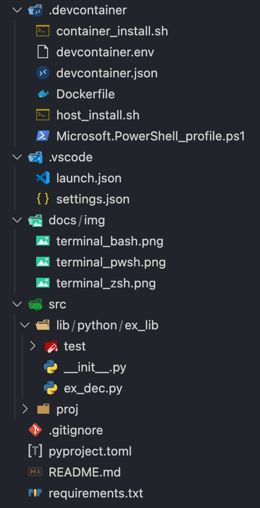

# vscode-dev-container

This is my personal, fully configured dev environment for python, powershell, shell coding and more (Markdown, YAML, TOML, etc). Its optimized to ease development and provide beautiful code (replacing other IDE's like Pycharm, Windows PowerShell ISE, etc).

## Language Enhancements
<!-- markdownlint-disable MD033 -->
<table><tr><td>Language</td><td>Enhancements</td></tr>
<tr><td>Markdown</td><td><ul><li>Auto-Preview</li><li>Formatting (markdownlint)</li><li>Linting (markdownlint)</li><li>More...</li></ul></td></tr>
<tr><td>Python</td><td><ul><li>Auto-REPL</li><li>Documenting (autoDocstring)</li><li>Execution (code runner)</li><li>Formatting (black, autopep8, yapf)</li><li>Intellisense (pylance, type hints)</li><li>Linting (mypy, bandit, flake8, pylint, pycodestyle)</li><li>Testing (pytest)</li><li>More...</li></ul></td></tr>
<tr><td>PowerShell</td><td><ul><li>Execution (code runner)</li><li>Formatting (powershell)</li><li>Intellisense (powershell)</li><li>Linting (psscriptanalyzer)</li><li>Testing (tbd)</li><li>More...</li></ul></td></tr>
<tr><td>TOML</td><td><ul><li>Formatting (prettier toml)</li><li>Linting (better toml)</li><li>More...</li></ul></td></tr>
<tr><td>YAML</td><td><ul><li>Formatting (red hat)</li><li>Linting (red hat)</li><li>More...</li></ul></td></tr>
<tr><td>Other</td><td><ul><li>Formatting (prettier)</li><li>More...</li></ul></td></tr>
</table>

## IDE Enhancements

* TODOs tree
* Task explorer
* Icons for files/folders in explorer view
* More

## Terminal Enhancements

* Defaults to bash
* Support for bash, pwsh, and zsh
* Standard prompt and theming through [oh-my-posh](https://ohmyposh.dev)
* -NoLogo PowerShell terminal
* More

## Screenshots

### Python

### Linting

### Terminals

Bash

ZSH

PWSH

### Explorer

## Installation

This setup utilizes a [dev container](https://code.visualstudio.com/docs/remote/containers) to configure the entire environment. So, we simply need VS Code, Docker Desktop, and the code from this repo.

1. Install [VS Code](https://code.visualstudio.com/download) and install the [Remote-Containers extension](https://marketplace.visualstudio.com/items?itemName=ms-vscode-remote.remote-containers)
2. Clone this repo
3. Install [Docker Desktop](https://docs.docker.com/get-docker/) and configure its settings to start at login
4. Run `.devcontainer/host_install.sh` to install the font required to properly display terminal prompts (currently OSX only)
5. Start VS Code, run the Remote-Containers: Open Folder in Container... command from the Command Palette (F1) or quick actions Status bar item, and select the cloned repo folder.

## Configuration

Update the values in .devcontainer/devcontainer.env to set your time zone, desired PowerShell version, etc.
